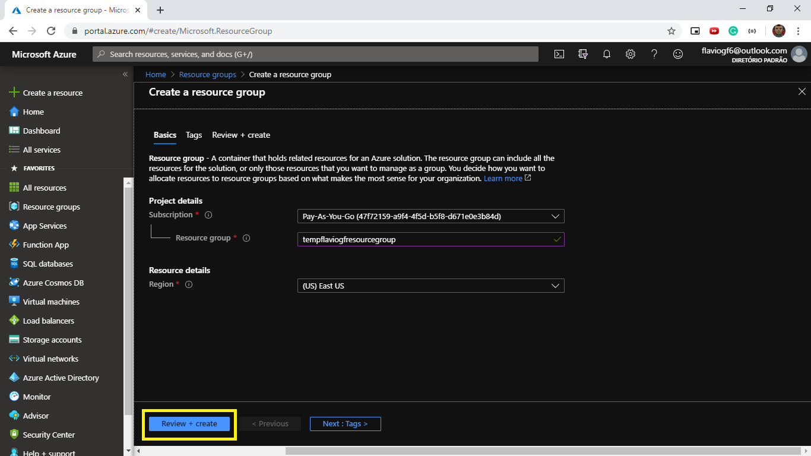

## Introdução

O Azure serviço de cloud da Microsoft, disponibiliza um catálogo enorme de produtos para computação em nuvem, o Azure App Service Web Apps é um destes, que tem como premissa facilitar o processo de build e deploy de uma aplicação web, podendo essa ser uma aplicação web tradicional ou uma web api, nas mais variadas teconologias como .NET Core, ASP.NET, Java, Node.js, PHP, Python ou Ruby.

Neste artigo vamos aprender como realizar o deploy de uma aplicação Node.js da forma mais prática através do Portal do Azure.

## Requisitos

Para prosseguir é necessário que você já tenha criado uma conta no Azure, um processo simples que necessita apenas que você tenha uma e-mail da Microsoft (hotmail ou outlook) e um cartão internacional, a solicitação do cartão no momento do cadastro é somente para fins de segurança, podendo gerar um custo que será estornado no momento seguinte.

## Acessando o Portal

Depois de termos acesso a conta do Azure, logo após a realização do cadastro ou do login, nós teremos acesso ao Portal do Azure, que a princípio pode ser assutador, mas logo depois de entendermos como as coisas são organizadas tudo vai ficando mais claro.

Essa á a tela inicial que pode estar um pouco diferente da sua, pois o Portal do Azure é personalizavel, podendo realizar algumas pequenas modificação na sua aparência, como a paleta de cores por exemplo.

## Criando um Resource Group

O primeiro passo para a configuração de um Azure App Service Web App é a criação de um Resource Group, para isso nós vamos fazer uma busca pelo termo "Resource groups" na barra de pesquisa e selecionar a opção "Resource groups".

Depois de selecionarmos a opção veremos uma listagem contendo todos os Resource Groups já criados em nossa conta, para criarmos um novo nós podemos selecionar a opção "Add" para irmos para o formulário de criação. Esses passos são semelhantes para a maioria dos serviços no Azure, normalmente fazemos uma busca, vemos uma listagem e selecionamos a opção para adicionar um novo.

Nesta etapa nós devemos informar nossas preferências a respeito do Resource group a ser criado, selecionando uma Subscription (normalmente é criado uma no momento de cadastro no Azure mas nós podemos adicionar outras posteriormente), informando um nome e selecionando uma região. Depois disso podemos selecionar a opção "Review + create", e por fim a opção "Create". No exemplo eu selecionei a minha Subscription padrão, dei o nome do Resource Group como "tempflaviogfresourcegroup" e selecionei a região como East US.

## Criando um App Service Plan

Avançando vamos criar um outro recurso necessário, que é a criação de um App Service Plan como dito anteriormente é muito semelhante. Para isso nós vamos fazer uma busca pelo termo "App Service Plans" na barra de pesquisa e selecionar a opção "App Service plans" 

Depois de selecionarmos a opção veremos uma listagem agora contendo todos os App Service Plans já criados em nossa conta, para criarmos um novo nós podemos selecionar a opção "Add" para irmos para o formulário de criação.

## Criando um App Service Web App

## Configurando seu projeto

## Realizando o deploy

## Descartando todos os recursos (Opcional)
