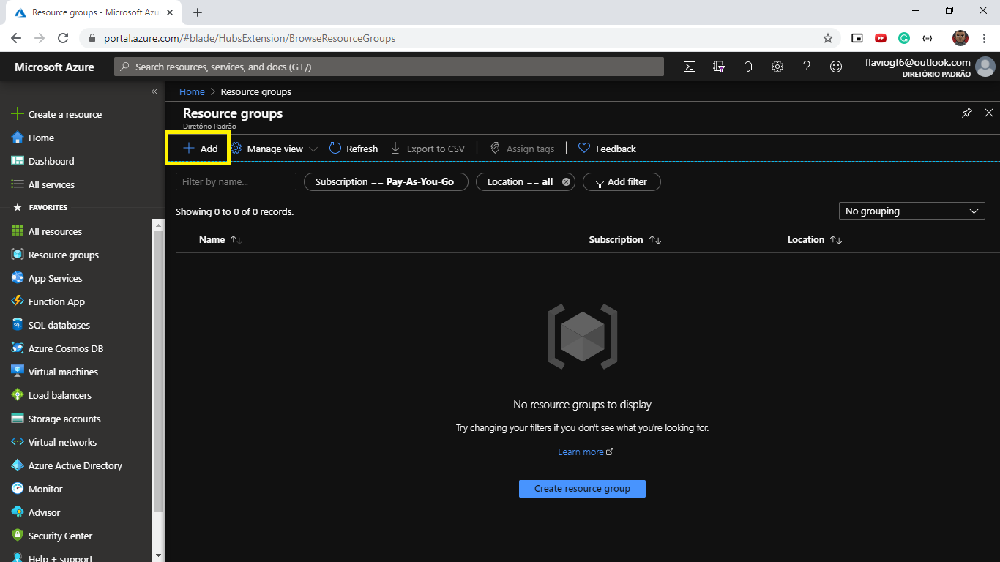

## Introdução

O Azure (serviço de cloud da Microsoft), disponibiliza um catálogo enorme de produtos para computação em nuvem, o Azure App Service Web Apps é um destes, que tem como premissa facilitar o processo de build e deploy de uma aplicação web, podendo essa ser uma aplicação web tradicional ou uma web api, nas mais variadas teconologias como .NET Core, ASP.NET, Java, Node.js, PHP, Python ou Ruby. Neste artigo você vai aprender como realizar o deploy de uma aplicação Node.js da forma mais prática no Azure.

## Requisitos

É necessario que você já tenha criado uma conta no Azure, um processo simples que necessita apenas que você tenha uma e-mail da Microsoft (Hotmail ou Outlook) e um cartão internacional, a solicitação do cartão no momento do cadastro é só para fim de verificação, podendo gerar um custo que será estornado no momento seguinte.

## Acessando o Portal

Depois de criado a conta você terá acesso ao Portal do Azure, que pode ser assustador de inicio, mas logo você começa a entender como ele esta organizado e tudo fica mais facil. Esta é a Home, a tela inicial logo após você acessar o portal.

Obs: Minha Home pode estar um pouco diferente pois é possivel personalizar o portal, podendo alterar a paleta de cores e como as informaçãos são distribuidas na tela.

## Criando um Resource Group

O primeiro passo para configuração é a criação de um Resource Group ou grupo de recursos, para isso é só você buscar pelo termo "Resource groups" na barra de pesquisa e selecionar este.

Depois de selecionado você irá visualizar a lista de todos os grupos de recursos em sua conta, se não existir será uma listagem vazia. Para criar um novo grupo de recurso você deve selecionar a opção "Add" na parte superior da tela.

## Criando um App Service Plan

## Criando um App Service Web App

## Configurando seu projeto

## Realizando o deploy

## Descartando todos os recursos (Opcional)
